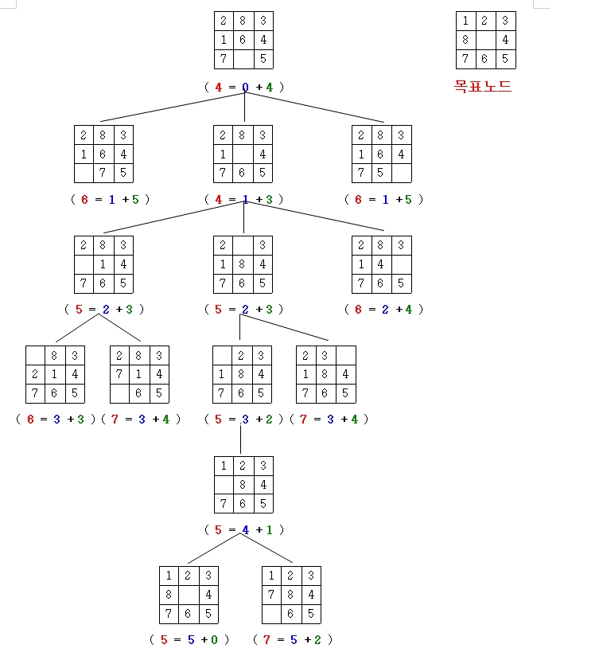

# 8-Puzzle Problem

## Program

The program is written in C++ and consists of `Matrix`, `Node`, and `Solver`.

The class `Matrix` represents the matrix of a puzzle. It stores the elements and the position of the blank tile. The class `Node` represents a node of the graph. It has a `Matrix`, the distance, the heuristic value, etc. The class `Solver` solves the puzzle.

The program uses **A\* algorithm**. At each iteration of loop, it needs to determine which of its paths to extend. The program selects the path that minimizes the following cost:

$$
f(n) = g(n) + h(n)
$$

where $n$ is the next node on the path, $g(n)$ is the distance from start node to the node $n$, and $h(n)$ is the number of misplaced tiles.

The process of solving the problem with the A\* algorithm:

(red: $f(n)$, blue: $g(n)$, green: $h(n)$)

{ width=50% }

The description of each function of the program is in the header files (`*.hpp`). I don't write it here unnecessarily.

### Unsolvable puzzles

There is one more thing to consider. Not all puzzles are solvable, and therefore we should check if the given puzzle is solvable.

A pair of tiles form an **"inversion"** if the values on tiles are in reverse order. For example, the following puzzle has two inversions, (8, 6) and (8, 7).

```
1 2 3
4 _ 5
8 6 7
```

The number of inversions of a state(matrix) can be odd or even, and it is called a state's *parity*. All legal moves don't change the parity. If the initial state and the goal state have the same parity, the problem is solvable. Otherwise, it is unsolvable.

For example, the following puzzle is unsolvable:

```
start:
3 8 1
6 2 5
_ 4 7

goal:
1 2 3
8 _ 4
7 6 5
```

## Source code

You can find the source code in the `*.zip` file submitted separately. The `README.md` within the file describes how to build and run the code.

Only `main.cpp` is here:

```cpp
#include "solver.hpp"
#include <iostream>

void solve (int initial_array[], int goal_array[]) {
    eight_puzzle::Matrix initial {initial_array};
    eight_puzzle::Matrix goal {goal_array};
    eight_puzzle::Solver solver { initial, goal };
    solver.solve();
}

void question_1 () {
    std::cout << "========== Question-1 ==========" << std::endl << std::endl;
    int initial_array[] {
        2, 8, 3,
        1, 6, 4,
        7, BLANK, 5
    };
    int goal_array[] {
        1, 2 ,3,
        8, BLANK, 4,
        7, 6, 5
    };
    solve(initial_array, goal_array);
}

void question_2 () {
    std::cout << "========== Question-2 ==========" << std::endl << std::endl;
    int initial_array[] {
        3, 8, 1,
        6, 2, 5,
        BLANK, 4, 7
    };
    int goal_array[] {
        1, 2 ,3,
        8, BLANK, 4,
        7, 6, 5
    };
    solve(initial_array, goal_array);
}

void question_3 () {
    std::cout << "========== Question-3 ==========" << std::endl << std::endl;
    int initial_array[] {
        1, 4, 3,
        7, BLANK, 6,
        5, 8, 2
    };
    int goal_array[] {
        1, 3, 6,
        7, 4, 2,
        5, 8, BLANK
    };
    solve(initial_array, goal_array);
}

int main () {
    question_1();
    question_2();
    question_3();
    return 0;
}
```

## Results

### Question 1

```
========== Question-1 ==========

:: [Node #1]
| 2 | 8 | 3 |
 --- --- ---
| 1 | 6 | 4 |
 --- --- ---
| 7 |   | 5 |
 - dist = 0, heuristic = 5
 - cost = dist + heuristic = 5

:: [Node #2]
| 2 | 8 | 3 |
 --- --- ---
| 1 |   | 4 |
 --- --- ---
| 7 | 6 | 5 |
 - dist = 1, heuristic = 3
 - cost = dist + heuristic = 4

:: [Node #3]
| 2 |   | 3 |
 --- --- ---
| 1 | 8 | 4 |
 --- --- ---
| 7 | 6 | 5 |
 - dist = 2, heuristic = 4
 - cost = dist + heuristic = 6

:: [Node #4]
|   | 2 | 3 |
 --- --- ---
| 1 | 8 | 4 |
 --- --- ---
| 7 | 6 | 5 |
 - dist = 3, heuristic = 3
 - cost = dist + heuristic = 6

:: [Node #5]
| 1 | 2 | 3 |
 --- --- ---
|   | 8 | 4 |
 --- --- ---
| 7 | 6 | 5 |
 - dist = 4, heuristic = 2
 - cost = dist + heuristic = 6

:: [Node #6]
| 1 | 2 | 3 |
 --- --- ---
| 8 |   | 4 |
 --- --- ---
| 7 | 6 | 5 |
 - dist = 5, heuristic = 0
 - cost = dist + heuristic = 5
```

### Question 2

```
========== Question-2 ==========

| 3 | 8 | 1 |
 --- --- ---
| 6 | 2 | 5 |
 --- --- ---
|   | 4 | 7 |
:: Unsolvable puzzle
```

### Question 3

```
========== Question-3 ==========

:: [Node #1]
| 1 | 4 | 3 |
 --- --- ---
| 7 |   | 6 |
 --- --- ---
| 5 | 8 | 2 |
 - dist = 0, heuristic = 5
 - cost = dist + heuristic = 5

:: [Node #2]
| 1 |   | 3 |
 --- --- ---
| 7 | 4 | 6 |
 --- --- ---
| 5 | 8 | 2 |
 - dist = 1, heuristic = 4
 - cost = dist + heuristic = 5

:: [Node #3]
| 1 | 3 |   |
 --- --- ---
| 7 | 4 | 6 |
 --- --- ---
| 5 | 8 | 2 |
 - dist = 2, heuristic = 3
 - cost = dist + heuristic = 5

:: [Node #4]
| 1 | 3 | 6 |
 --- --- ---
| 7 | 4 |   |
 --- --- ---
| 5 | 8 | 2 |
 - dist = 3, heuristic = 2
 - cost = dist + heuristic = 5

:: [Node #5]
| 1 | 3 | 6 |
 --- --- ---
| 7 | 4 | 2 |
 --- --- ---
| 5 | 8 |   |
 - dist = 4, heuristic = 0
 - cost = dist + heuristic = 4
```
